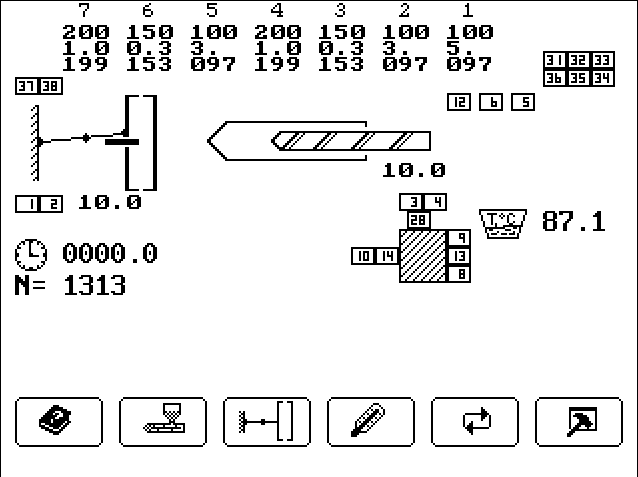
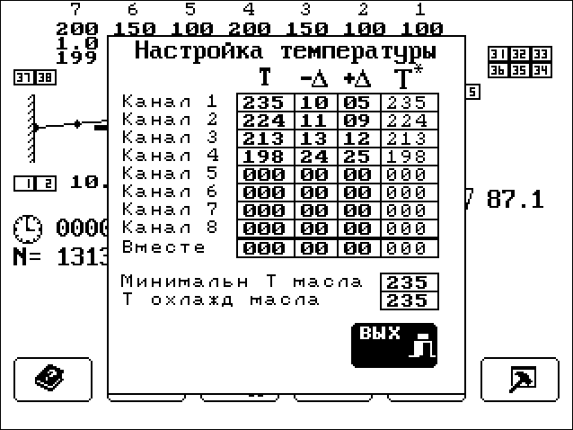
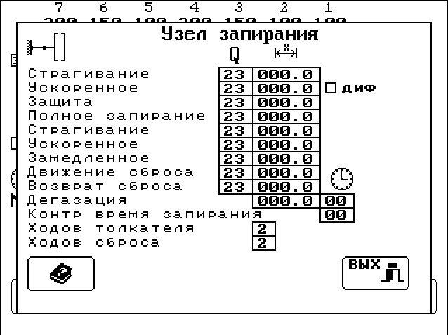

# Thermo-plast automaton

This is an embedded GUI library created for Managing Systems in 2003.
Released with the permission of the code owner, since the platform has changed.

- **dfmc** stands for Delphi Form Compiler, parses Delphi files to produce C code
- **emul** library + platform emulators for win32 and X11
- **pult** source code for the application sketch
- **doc** stands for itself

The appliance was successfully implemented within few months, and intensively
produced and sold during 5 years.

